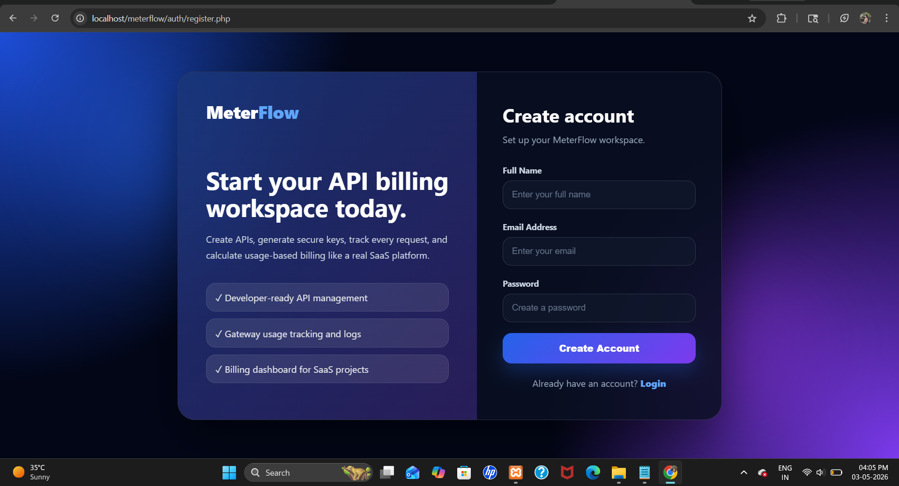
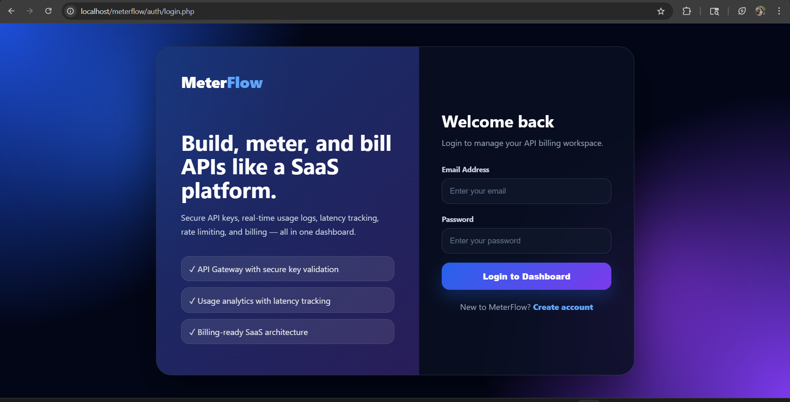
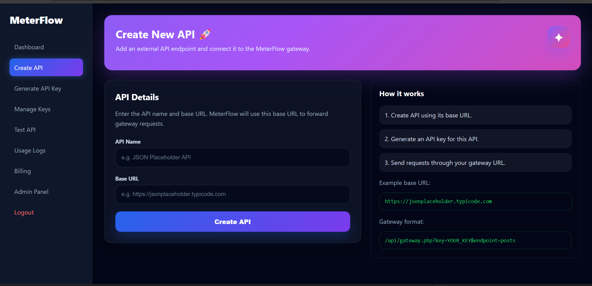
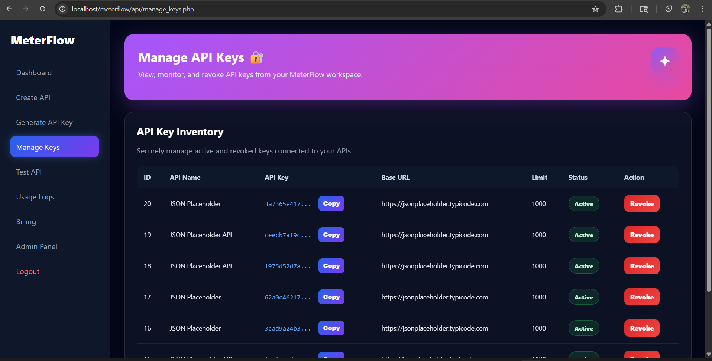
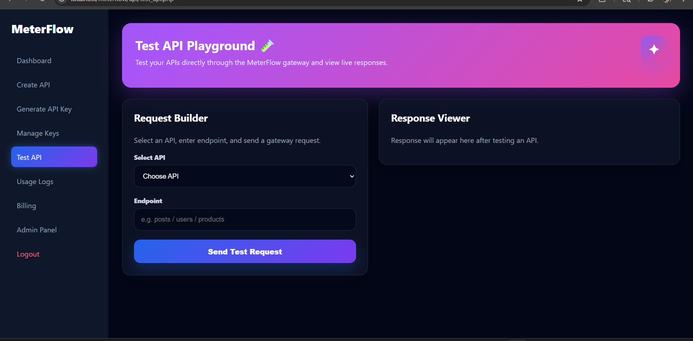
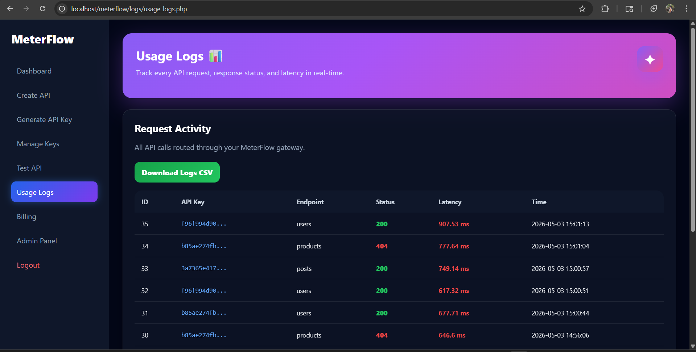
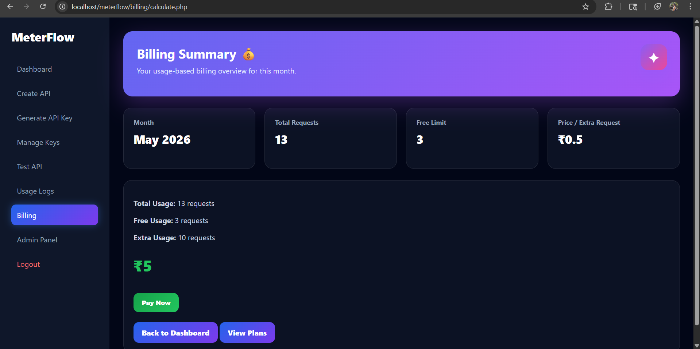
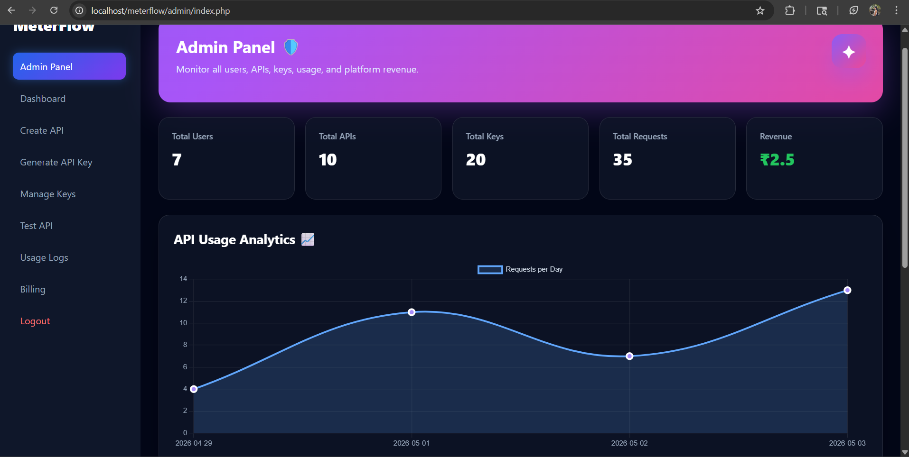
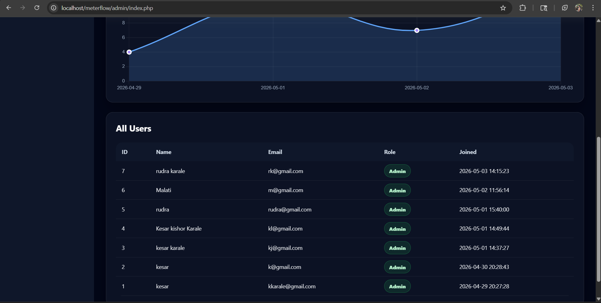

**🚀 MeterFlow – API Usage & Billing SaaS**

**A complete API management and billing SaaS platform built using PHP & MySQL.
MeterFlow allows users to create APIs, generate keys, track usage, and manage billing with a clean dashboard.**

---
**🌟 Features**

**🔐 Authentication**

User Registration & Login
Session-based authentication

**📊 Dashboard**

Total APIs, Keys, Requests
Billing summary
Usage analytics graph
Clean SaaS UI

**🔑 API Management**

Create API
Generate API Key
Manage & revoke keys

**🔄 API Gateway**

Secure API access using API keys
Endpoint forwarding
Request validation

**📜 Usage Logs**

Track all API requests
Status code monitoring
Timestamp logs

**💰 Billing System**

Free usage limit
Pay-per-request model
Automatic bill calculation

**💳 Payment System (Demo)**

Checkout popup flow
Payment method selection (UPI, Card, Net Banking)
Payment success simulation

**📦 Subscription Plans**

Free Plan
Pro Plan (usage-based)
Enterprise Plan (custom)

**🛠 Admin Panel**

View total users, APIs, keys
Revenue tracking
System analytics

**🧱 Tech Stack**

Frontend: HTML, CSS (custom SaaS UI)
Backend: PHP (Core PHP)
Database: MySQL
Server: XAMPP / Localhost

---

**📁 Project Structure**

meterflow/                                                                       
│                                                                                   
├── auth/                                                             
│   ├── login.php                                                                 
│   ├── register.php                                                                                                  
│   └── logout.php                                                                               
│                                                                                                     
├── dashboard/                                                                                        
│   └── index.php                                                                                       
│                                                                                                         
├── api/                                                                                  
│   ├── create_api.php                                                                                 
│   ├── generate_key.php                                                                       
│   ├── manage_keys.php                                                                                              
│   ├── gateway.php                                                                   
│   └── test_api.php                                                                                            
│                                                                                                                 
├── logs/                                                                                                   
│   └── usage_logs.php                                                                                             
│                                                                                                                       
├── billing/                                                                                                                                    
│   ├── calculate.php                                                                                                                              
│   └── plans.php                                                                                                                                            
│                                                                                                                                         
├── admin/                                                                                               
│   └── index.php                                                                                                         
│                                                                                                                       
├── config/                                                                                                            
│   └── db.php                                                                                                                   
│                                                                                                                         
└── database.sql                                                                             

---

**⚙️ Installation**

**1️⃣ Clone the repository** 

git clone https://github.com/your-username/meterflow.git

**2️⃣ Move to XAMPP**

Place folder inside:
htdocs/

**3️⃣ Import Database**

Open phpMyAdmin

Create database: meterflow

Import database.sql

**4️⃣ Configure Database**
Edit:

config/db.php
$conn = mysqli_connect("localhost", "root", "", "meterflow");

**5️⃣ Run Project**

Open:

http://localhost/meterflow

**🔌 API Gateway Usage**

Example request:

http://localhost/meterflow/api/gateway.php?key=YOUR_API_KEY&endpoint=users

---

**💰 Billing Logic**

Free Limit: Configurable (default: 1000 or custom)

Price: ₹0.5 per extra request

Formula:

extra_requests = total_requests - free_limit

amount = extra_requests * price_per_request

**🎯 Future Improvements**

Real payment integration (Razorpay / Stripe)
Invoice generation
Email notifications
Rate limiting
API analytics charts (advanced)
Multi-tenant SaaS support
---

**📸 Screenshots**

 **Register Page**

 **Login Page**

 **Dashboard Page**

 **Create-API Page**

 **Generate-API Page**

 **Manage-API Key Page**

 **Test API Page**

 **Usage_Log Page**

 **Billing Page**

 **Admin Panel**

 

**👨‍💻 Author**

Kesar Karale

**📌 Note**

This project is built for learning & demonstration purposes and simulates SaaS billing and payment flow.
 
